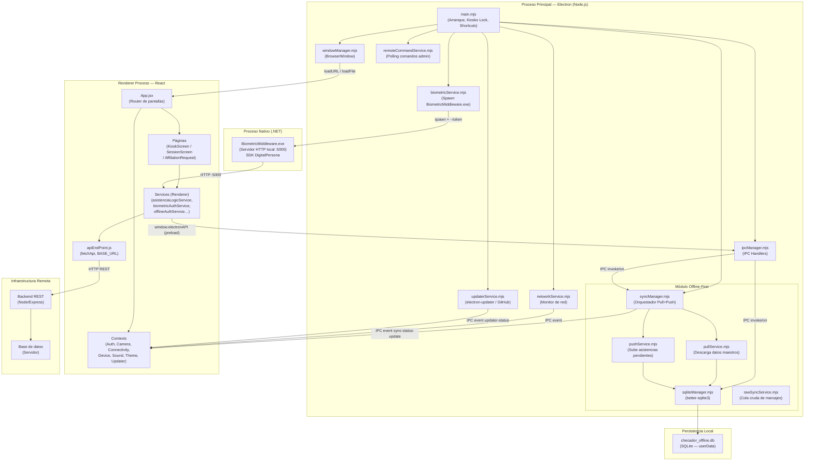
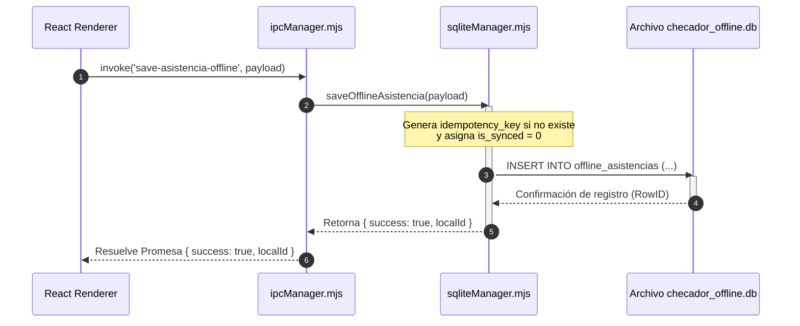
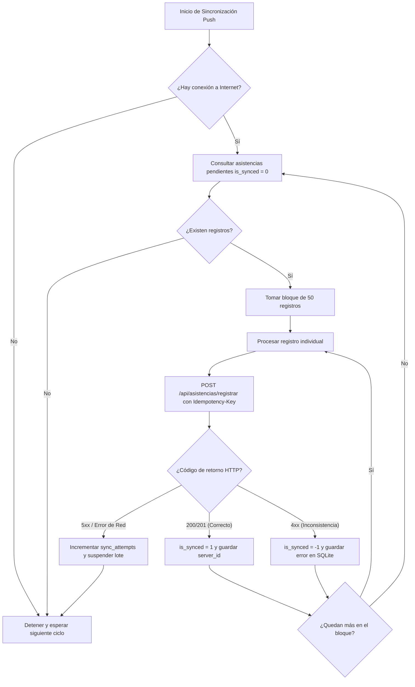
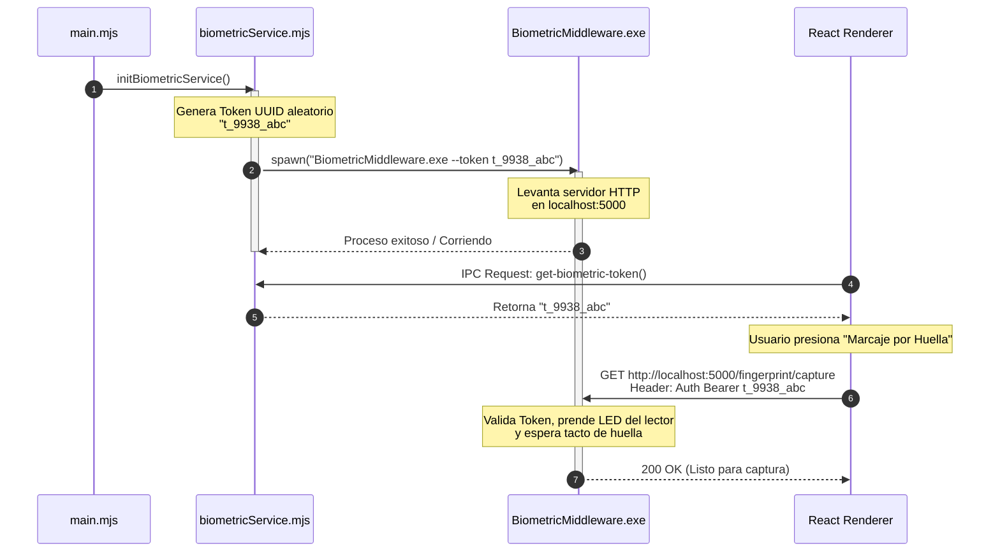
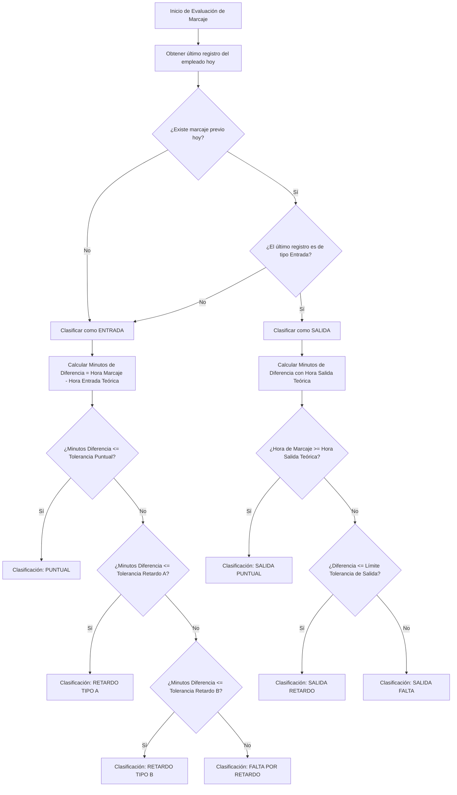
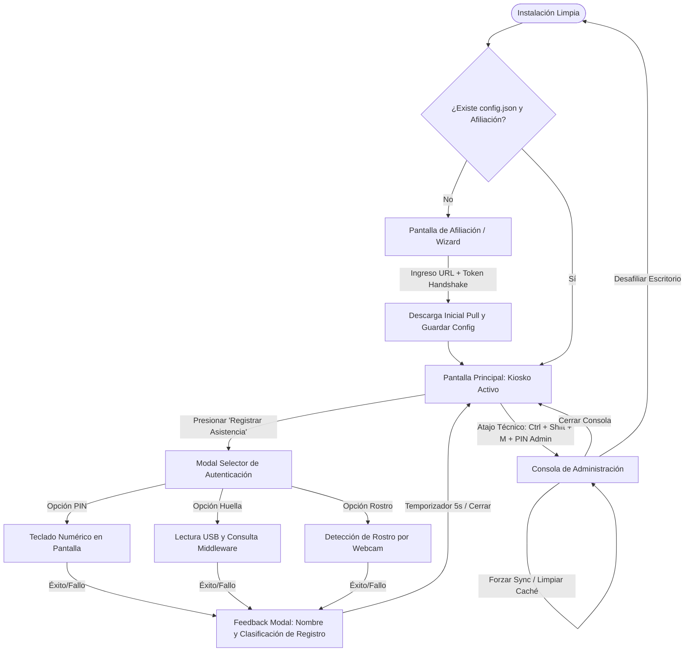

# Manual Técnico — Sistema de Asistencia Kiosko (FASITLAC)

---

## 1. Visión General y Arquitectura del Sistema

El **Sistema de Asistencia Kiosko** es una aplicación de escritorio **Offline-First** construida sobre **Electron**, que combina un frontend en **React** (renderizado en el proceso renderer) con una capa de procesos nativos en el proceso principal. La arquitectura es **cliente-servidor desconectable**: el kiosko opera de forma autónoma cuando no hay red y sincroniza asistencias con el backend REST en cuanto recupera conectividad.

El sistema integra tres capas de autenticación biométrica:
- **PIN numérico** (validado contra hash almacenado en SQLite).
- **Huella dactilar** mediante un middleware .NET (`BiometricMiddleware.exe`) que usa el SDK DigitalPersona.
- **Reconocimiento facial** usando `@vladmandic/face-api` corriendo en el renderer.

### Diagrama de Arquitectura



---

## 2. Requisitos Previos y Entorno de Desarrollo

### Dependencias del Sistema

| Herramienta | Versión mínima | Propósito |
|---|---|---|
| **Node.js** | 18 LTS | Runtime de Electron y scripts de build |
| **npm** | 9+ | Gestión de paquetes |
| **.NET SDK** | 4.8 (Framework) | Compilar `BiometricMiddleware.csproj` (x86) |
| **DigitalPersona One Touch SDK** | Última estable | DLLs nativas para huella dactilar |
| **Windows** | 10/11 x64 | Plataforma objetivo de producción |
| **Electron** | 39.x | Empaquetado de la app de escritorio |
| **electron-builder** | 26.x | Generación del instalador NSIS |

> **Nota:** El instalador MSI del SDK de DigitalPersona debe colocarse en `electron/BiometricMiddleware/installers/DigitalPersona_SDK_Setup.msi` para que el sistema lo instale automáticamente.

### Dependencias npm Principales

**Runtime (`dependencies`):**

| Paquete | Versión | Uso |
|---|---|---|
| `@vladmandic/face-api` | ^1.7.15 | Reconocimiento facial (renderer) |
| `better-sqlite3` | ^12.6.2 | Base de datos SQLite local (proceso principal) |
| `canvas` | ^3.2.0 | Soporte Canvas para face-api en Node |
| `electron-updater` | ^6.8.3 | Auto-actualización desde GitHub Releases |
| `react` / `react-dom` | ^18.2.0 | UI del kiosko |
| `lucide-react` | ^0.263.1 | Iconografía |
| `uuid` | ^13.0.0 | Generación de `idempotency_key` |

**Dev (`devDependencies`):**

| Paquete | Versión | Uso |
|---|---|---|
| `vite` | ^4.4.5 | Bundler del renderer |
| `electron` | ^39.2.5 | Framework de escritorio |
| `electron-builder` | ^26.7.0 | Empaquetado e instalador NSIS |
| `concurrently` | ^9.2.1 | Ejecutar Vite + Electron en paralelo |
| `cross-env` | ^10.1.0 | Variables de entorno cross-platform |
| `tailwindcss` | ^3.3.3 | Estilos CSS utilitarios |
| `wait-on` | ^9.0.3 | Esperar a que Vite sirva antes de abrir Electron |

### Variables de Entorno (`.env`)

El archivo `.env` en la raíz del proyecto define:

| Variable | Descripción | Ejemplo |
|---|---|---|
| `KIO_UPDATER_TOKEN` | Token secreto para verificar actualizaciones automáticas desde GitHub Releases. Debe ser una cadena larga y aleatoria. | `MiToken_Largo_Y_Dificil_1234!!` |

> **Importante:** No exponer este archivo en repositorios públicos. Agregar `.env` al `.gitignore`.

La URL base del backend se configura en tiempo de ejecución mediante el proceso de **afiliación del escritorio**, y se persiste en el archivo `config.json` dentro del directorio `userData` de Electron (gestionado por `configHelper.mjs`).

---

## 3. Estructura del Proyecto y Módulos

```
escritorio/
├── electron/                        # Proceso principal (Node.js / Electron)
│   ├── main.mjs                     # Punto de entrada: ventana, IPC, shortcuts, arranque
│   ├── preload.cjs                  # Puente seguro renderer ↔ main (contextBridge)
│   ├── managers/
│   │   ├── ipcManager.mjs           # Todos los handlers IPC (invoke/on)
│   │   └── windowManager.mjs        # Creación y gestión de BrowserWindow
│   ├── services/
│   │   ├── biometricService.mjs     # Spawn del BiometricMiddleware.exe
│   │   ├── networkService.mjs       # Monitoreo de conectividad de red
│   │   ├── remoteCommandService.mjs # Polling de comandos remotos del admin
│   │   └── updaterService.mjs       # Lógica de auto-actualización (electron-updater)
│   ├── offline/
│   │   ├── sqliteManager.mjs        # CRUD SQLite + migraciones (fuente de verdad local)
│   │   ├── syncManager.mjs          # Orquestador Pull + Push con timer
│   │   ├── pullService.mjs          # Descarga datos maestros del servidor → SQLite
│   │   ├── pushService.mjs          # Envía asistencias pendientes → servidor
│   │   ├── rawQueueManager.mjs      # Cola cruda de marcajes (sistema alternativo)
│   │   └── rawSyncService.mjs       # Sincronización de la cola cruda
│   ├── utils/
│   │   └── configHelper.mjs         # Lectura/escritura de config.json persistente
│   ├── watchdog/                    # Watchdog de proceso (reinicio automático)
│   └── BiometricMiddleware/         # Proyecto .NET para huella dactilar
│       ├── BiometricMiddleware.csproj
│       ├── bin/                     # Ejecutable compilado (.exe + DLLs)
│       └── installers/              # MSI del SDK DigitalPersona
│
├── src/                             # Proceso Renderer (React + Vite)
│   ├── main.jsx                     # Punto de entrada React
│   ├── App.jsx                      # Router de pantallas y árbol de providers
│   ├── index.css                    # Estilos globales + variables CSS (tema)
│   ├── config/
│   │   └── apiEndPoint.js           # BASE_URL, endpoints y fetchApi helper
│   ├── context/                     # Estado global compartido (React Context)
│   │   ├── AuthContext.jsx          # Sesión del administrador del kiosko
│   │   ├── CameraContext.jsx        # Acceso a webcam para reconocimiento facial
│   │   ├── ConnectivityContext.jsx  # Estado online/offline propagado a toda la UI
│   │   ├── DeviceMonitoringContext.jsx # Estado de dispositivos biométricos USB
│   │   ├── SoundContext.jsx         # Sonidos de feedback (beep de éxito/error)
│   │   ├── ThemeContext.jsx         # Tema claro/oscuro
│   │   └── UpdaterContext.jsx       # Estado del proceso de actualización
│   ├── pages/
│   │   ├── KioskScreen.jsx          # Pantalla principal del kiosko (marcaje)
│   │   ├── SessionScreen.jsx        # Sesión de administrador
│   │   └── AffiliationRequest.jsx   # Pantalla de afiliación inicial del escritorio
│   ├── components/
│   │   ├── kiosk/                   # Modales de PIN, Huella y Facial
│   │   ├── session/                 # Componentes de sesión admin
│   │   ├── affiliation/             # Wizard de afiliación
│   │   ├── maintenance/             # Pantallas de mantenimiento y nodo deshabilitado
│   │   ├── common/                  # Componentes reutilizables (modales, botones)
│   │   └── UpdaterOverlay.jsx       # Overlay de actualización automática
│   ├── services/                    # Lógica de negocio del renderer
│   │   ├── asistenciaLogicService.js   # Cálculo de estado (puntual/retardo/falta)
│   │   ├── biometricAuthService.js     # Autenticación facial y dactilar
│   │   ├── offlineAuthService.js       # Autenticación cuando no hay red
│   │   ├── authService.js              # Login/logout de administrador
│   │   ├── empleadoService.js          # CRUD de empleados (API)
│   │   ├── horariosService.js          # Consulta de horarios
│   │   ├── deviceDetectionService.js   # Detección de dispositivos USB
│   │   ├── deviceMonitorService.js     # Monitoreo continuo de dispositivos
│   │   └── escritorioService.js        # Configuración del escritorio
│   ├── hooks/                       # Hooks personalizados de React
│   └── utils/                       # Utilidades (formateo, validación)
│
├── public/                          # Assets estáticos (logo, licencia)
├── index.html                       # HTML base de Vite
├── vite.config.js                   # Configuración de Vite
├── tailwind.config.js               # Configuración de Tailwind CSS
├── package.json                     # Metadatos, scripts y configuración de electron-builder
└── .env                             # Variables de entorno locales
```

### Responsabilidad de cada capa

| Capa | Responsabilidad |
|---|---|
| **`electron/main.mjs`** | Inicialización de la app, registro de atajos globales bloqueados (modo kiosko), instancia única, arranque de todos los servicios del proceso principal |
| **`electron/preload.cjs`** | Expone de forma segura las APIs del proceso principal al renderer via `contextBridge` (IPC, offlineDB, syncManager, updater, bitácora) |
| **`electron/managers/ipcManager.mjs`** | Define y registra todos los handlers `ipcMain.handle()` que el renderer invoca via `window.electronAPI` |
| **`electron/offline/`** | Núcleo Offline-First: SQLite como fuente de verdad local, ciclo Pull→Push, colas de asistencias, migraciones automáticas |
| **`electron/services/biometricService.mjs`** | Gestión del ciclo de vida del `BiometricMiddleware.exe` (spawn, token de sesión, detención) |
| **`src/context/`** | Estado global reactivo: conectividad, autenticación, cámara, dispositivos, tema y actualizador |
| **`src/pages/`** | Pantallas completas: Kiosko (marcaje), Sesión Admin, Afiliación inicial |
| **`src/services/asistenciaLogicService.js`** | Motor de reglas de asistencia: calcula `puntual`, `retardo_a/b`, `falta_por_retardo`, `salida_puntual/retardo/falta` según horario y tolerancia del rol |
| **`src/services/offlineAuthService.js`** | Valida credenciales (PIN / huella / facial) contra la caché SQLite cuando no hay red |
| **`src/config/apiEndPoint.js`** | Centraliza la `BASE_URL` y todos los endpoints REST; proporciona `fetchApi` con manejo de errores y eventos `api-online`/`api-offline` |

---

## 4. Flujo de Datos Core

### 4.1 Registro de Asistencia por PIN (modo Online)

```
[Empleado introduce PIN en KioskScreen]
        │
        ▼
[biometricAuthService.js]
  → verifica PIN contra hash (SHA-256 o bcrypt) del servidor
        │
        ▼
[asistenciaLogicService.js — cargarDatosAsistencia()]
  → Promise.all([
      obtenerUltimoRegistro(empleadoId),   // GET /api/asistencias/empleado/:id
      obtenerHorario(empleadoId),           // GET /api/empleados/:id/horario
      obtenerTolerancia(usuarioId)          // GET /api/usuarios/:id/roles → /tolerancias/:id
    ])
        │
        ▼
[calcularEstadoRegistro(ultimo, horario, tolerancia)]
  → agruparTurnosConcatenados() — fusiona bloques < 15 min
  → validarEntrada() o validarSalida()
  → Clasifica: puntual | retardo_a | retardo_b | falta_por_retardo
               salida_puntual | salida_retardo | salida_falta
        │
        ▼
[registrarAsistenciaEnServidor()]
  → POST /api/asistencias/registrar
  → Payload: { empleado_id, tipo, clasificacion, estado,
               metodo_registro: 'PIN', dispositivo_origen: 'escritorio' }
        │
   ┌────┴────────────────────────┐
   │ 200 OK                      │ Error de red / 5xx
   │                             │
   ▼                             ▼
[Feedback visual de éxito]   [window.electronAPI.offlineDB.saveAsistencia()]
                               → IPC → ipcManager → sqliteManager.saveOfflineAsistencia()
                               → INSERT INTO offline_asistencias (is_synced=0)
                               → SyncManager lo subirá cuando haya red
```

### 4.2 Registro de Asistencia por Huella Dactilar

```
[Usuario toca lector DigitalPersona]
        │
        ▼
[BiometricMiddleware.exe — Servidor HTTP local :5000]
  → Captura template dactilar con SDK DigitalPersona
  → POST /api/fingerprint/match  (interno, autenticado con --token)
        │
        ▼
[biometricAuthService.js — Renderer]
  → GET http://localhost:5000/fingerprint/capture
  → Recibe { empleadoId, confidence, template }
        │
        ▼
[Continúa igual que flujo PIN desde calcularEstadoRegistro()]
```

### 4.3 Registro de Asistencia por Reconocimiento Facial

```
[CameraContext — webcam activa en el renderer]
        │
        ▼
[@vladmandic/face-api — en el renderer]
  → Detecta rostro y genera Float32Array descriptor (128 dimensiones)
        │
        ▼
[window.electronAPI.verificarUsuario(descriptor)]
  → IPC → ipcManager → offlineDB.getAllCredenciales()
  → Compara descriptor contra cache_credenciales.facial_descriptor (SQLite)
  → Encuentra match por distancia euclidiana < umbral
        │
        ▼
[Retorna { empleadoId, nombre, confianza }]
        │
        ▼
[Continúa igual que flujo PIN desde calcularEstadoRegistro()]
```

### 4.4 Sincronización Offline → Online (Push)

```
[syncManager.mjs — Timer cada 5 minutos (o al reconectar)]
        │
        ▼
[pushService.pushPendingRecords()]
  → sqliteManager.getPendingAsistencias(limit=50)
  → Para cada registro (is_synced=0):
      → POST /api/asistencias/registrar
         Headers: Idempotency-Key: <idempotency_key>
        │
   ┌───┴───────────────────┐
   │ 200/201               │ Error
   │                       │
   ▼                       ▼
markAsSynced(localId,   markSyncError(localId, error)
  serverId)               → sync_attempts++
  is_synced = 1           → Si definitivo: is_synced = -1
```

### 4.5 Descarga de Datos Maestros (Pull)

```
[syncManager — mismo ciclo o al recibir token]
        │
        ▼
[pullService.fullPull()]
  → GET /api/escritorio/:id/sync-data
     Respuesta: { empleados[], credenciales[], horarios[],
                  escritorios[], biometricos[] }
        │
        ▼
[sqliteManager.setReferenciaData(data)]
  → Transacción atómica:
    1. UPSERT cache_empleados
    2. UPSERT cache_credenciales  (ID estable: C_{empleadoId})
    3. UPSERT cache_horarios      (ID estable: H_{empleadoId})
    4. UPSERT cache_escritorio_info
    5. UPSERT cache_biometricos   (dedup por device_id + escritorio_id)
    6. Marca empleados eliminados del servidor como 'eliminado'
```

---

## 5. Configuración, Compilación y Despliegue

### 5.1 Instalación de Dependencias

```powershell
# Clonar el repositorio
git clone https://github.com/iDanielSoto/escritorio.git
cd escritorio

# Instalar dependencias de Node
npm install

# Reconstruir better-sqlite3 para la versión de Electron instalada
npm run rebuild
# Equivale a: npx electron-rebuild -f -w better-sqlite3
```

### 5.2 Compilar el BiometricMiddleware (.NET)

```powershell
# Requiere .NET SDK 4.8 y MSBuild instalados
cd electron/BiometricMiddleware
dotnet build BiometricMiddleware.csproj -c Release -p:Platform=x86

# El ejecutable se genera en:
# electron/BiometricMiddleware/bin/x86/Release/net48/BiometricMiddleware.exe
# Copiarlo manualmente (o dejar que main.mjs lo haga automáticamente en dev):
mkdir -p electron/BiometricMiddleware/bin
cp bin/x86/Release/net48/BiometricMiddleware.exe electron/BiometricMiddleware/bin/
```

### 5.3 Configurar Variables de Entorno

```powershell
# Crear el archivo .env en la raíz del proyecto
Copy-Item .env.example .env   # Si existe plantilla
# O crearlo manualmente:
Set-Content .env "KIO_UPDATER_TOKEN=TuTokenLargoYSeguro_Aqui_1234!!"
```

### 5.4 Ejecutar en Modo Desarrollo

```powershell
# Opción A: Solo el servidor Vite (solo UI, sin Electron)
npm run dev

# Opción B: Electron + Vite en paralelo (recomendado)
npm run electron:dev
# Internamente ejecuta:
# concurrently "vite" "wait-on http://127.0.0.1:5174 && cross-env NODE_ENV=development electron ."
```

El servidor de desarrollo Vite escucha en `http://127.0.0.1:5174`.

### 5.5 Compilar para Producción

```powershell
# 1. Build del renderer (Vite → dist/)
npm run build

# 2. Empaquetar con electron-builder → release/
npm run electron:build
# Genera: release/Sistema de Asistencia Setup 1.0.1.exe  (instalador NSIS x64)
```

### 5.6 Publicar Release en GitHub

```powershell
# Requiere la variable GH_TOKEN con permisos de escritura en el repo
$env:GH_TOKEN = "ghp_TuPersonalAccessToken"
npm run release
# Equivale a: npm run build && electron-builder -p always
# Sube los artefactos a GitHub Releases automáticamente
```

### 5.7 Configuración del Instalador NSIS

El instalador generado tiene las siguientes características (configuradas en `package.json → build.nsis`):

| Parámetro | Valor |
|---|---|
| Instalación por máquina | `perMachine: true` (requiere admin) |
| Un clic | `oneClick: false` (muestra wizard) |
| Directorio configurable | `allowToChangeInstallationDirectory: true` |
| Acceso directo escritorio | `createDesktopShortcut: true` |
| Limpiar datos al desinstalar | `deleteAppDataOnUninstall: true` |
| Nivel de ejecución | `requireAdministrator` |

---

## 6. Requerimientos del Sistema

Para el correcto funcionamiento y despliegue del **Sistema de Asistencia Kiosko (FASITLAC)**, se especifican a continuación los requisitos mínimos y recomendados de hardware y software, tanto para el entorno de ejecución cliente (kiosko) como para el servidor que aloja la API y la persistencia centralizada.

### 6.1 Hardware

#### Servidor (Infraestructura de Backend/API)
Aunque el sistema de asistencia está diseñado bajo el enfoque **Offline-First** (lo que permite operar indefinidamente sin conexión), requiere de un servidor centralizado para consolidar y sincronizar los marcajes, así como proveer las actualizaciones de personal y horarios.

| Recurso | Requisito Mínimo | Requisito Recomendado |
| :--- | :--- | :--- |
| **CPU** | 2 núcleos (vCPU) a 2.0 GHz o superior | 4 núcleos o superior (ej. Intel Xeon / AMD EPYC) |
| **Memoria RAM** | 4 GB DDR4 | 8 GB o superior |
| **Almacenamiento** | 40 GB SSD (espacio libre) | 100 GB o superior SSD NVMe |
| **Conexión de Red** | 10 Mbps simétricos con IP pública estática | 100 Mbps o superior simétricos con DNS y SSL/TLS |

#### Equipos Cliente (Kiosko de Asistencia)
Cada kiosko de marcaje es una máquina dedicada instalada físicamente en el sitio de asistencia. Dado que ejecuta un proceso de Electron con procesamiento gráfico e inferencia local de IA (reconocimiento facial) y un servidor local .NET, el hardware cliente debe cumplir con características específicas.

| Recurso | Requisito Mínimo (Operación Básica) | Requisito Recomendado (Rendimiento Premium) |
| :--- | :--- | :--- |
| **CPU** | Intel Core i3 o AMD Ryzen 3 (Arquitectura x64) | Intel Core i5 / AMD Ryzen 5 o superior (x64) |
| **Memoria RAM** | 4 GB DDR4 | 8 GB DDR4 o superior (Mejora tiempos de face-api) |
| **Almacenamiento** | 20 GB HDD/SSD con 5 GB libres | 60 GB SSD con 20 GB libres (Para caché de fotos local) |
| **Puertos USB** | 1 Puerto USB 2.0 disponible | 2 Puertos USB 3.0+ disponibles |
| **Cámara Web** | Cámara USB estándar 640x480 | Cámara HD 720p o superior con sensor de baja iluminación |
| **Lector de Huella** | DigitalPersona U.are.U 4500 o compatible | DigitalPersona U.are.U 4500 / 5100 original |
| **Conexión de Red** | Tarjeta de red Fast Ethernet o WiFi de 2.4 GHz | Tarjeta de red Gigabit Ethernet o WiFi Dual-Band 5 GHz |

---

### 6.2 Software

#### Sistema Operativo Compatible
- **Entorno Cliente:** Windows 10 Home/Pro/Enterprise (versión 1809 de 64 bits o posterior) o Windows 11.
  > [!WARNING]
  > No se soportan arquitecturas de 32 bits (x86) para el entorno cliente global, ya que la biblioteca de reconocimiento facial y ciertos controladores de Electron están optimizados estrictamente para plataformas x64 de 64 bits.
- **Entorno Servidor:** Linux (Ubuntu Server 20.04+ LTS, Debian 11+ o RHEL 8+) o Windows Server 2019/2022.

#### Lenguajes de Programación y Versiones
- **Proceso Principal y Renderer (Vite/React):** Node.js v18.16.0 LTS o superior (hasta v20.x).
- **Proceso Nativo de Huellas:** .NET Framework 4.8 (compilación C# en arquitectura x86).
- **Lenguaje de Consulta Local:** SQL estructurado estándar para el motor SQLite 3.

#### Frameworks, Librerías y Dependencias del Proyecto
- **Electron (v39.2.x):** Runtime encargado de empaquetar e intercomunicar el backend nativo con la interfaz HTML/JS.
- **React (v18.2.x):** Framework para la construcción de la interfaz reactiva del kiosko.
- **Tailwind CSS (v3.3.x):** Framework CSS utilitario para la estilización visual y diseño de interfaz adaptable.
- **better-sqlite3 (v12.6.x):** Controlador nativo C++ de SQLite para un rendimiento de disco de alto nivel en transacciones sin bloqueo.
- **@vladmandic/face-api (v1.7.x):** Motor de inferencia en TensorFlow.js que corre en el navegador para detección facial local.
- **DigitalPersona One Touch SDK v2.x:** Controladores nativos provistos por el fabricante para habilitar la comunicación bidireccional y la manipulación de eventos del lector dactilar USB.

#### Herramientas de Desarrollo (IDEs, Compiladores)
- **Visual Studio Code:** IDE recomendado para la edición del frontend React y procesos auxiliares JS de Electron.
- **Visual Studio 2022 o Build Tools para .NET:** Requerido para abrir, editar y compilar el proyecto auxiliar de C# `BiometricMiddleware.csproj`.
- **Git:** Sistema de control de versiones distribuido.
- **electron-builder:** Compilador y empaquetador encargado de ensamblar el instalador final `.exe` con instaladores MSI embebidos.

---

## 7. Manejo de Errores, Logs y Seguridad

### 7.1 Estrategia de Logs

El sistema usa prefijos estandarizados en todos los `console.log/error/warn` para facilitar el filtrado:

| Prefijo | Significado | Ejemplo |
|---|---|---|
| `[Main]` | Proceso principal | `[Main] Status: Sistema Offline-First inicializado` |
| `[SQLite]` | Operaciones de base de datos | `[SQLite] Action: Asistencia offline guardada` |
| `[SyncManager]` | Ciclo Pull/Push | `[SyncManager] Event: Reconexion detectada` |
| `[BiometricService]` | Middleware de huella | `[BiometricService] Status: Token generado` |
| `[AsistenciaLogic]` | Cálculo de estado de asistencia | `[AsistenciaLogic] Grupos de turnos: [...]` |
| `[PullService]` | Descarga de datos | `[PullService] Status: 120 empleados descargados` |
| `[PushService]` | Subida de asistencias | `[PushService] Status: 5/5 sincronizados` |

**Ubicación de los logs en producción:**

Los logs de Electron (proceso principal) se almacenan en el directorio de logs estándar de la plataforma:

```
Windows: %APPDATA%\sistema-asistencia\logs\main.log
```

Accesible desde código con: `app.getPath('logs')`.

### 7.2 Tabla de Errores Comunes y Resolución

| Error | Causa | Resolución |
|---|---|---|
| `better-sqlite3` no carga | Módulo nativo no compilado para la versión de Electron | `npm run rebuild` |
| `BiometricMiddleware.exe` no encontrado | No se compiló el proyecto .NET | `dotnet build` en `electron/BiometricMiddleware/` |
| SDK no instalado | Faltan DLLs de DigitalPersona | Ejecutar el instalador MSI incluido |
| `is_synced = -1` | Asistencia con error definitivo (e.g., empleado no existe en servidor) | Revisar `offline_asistencias.last_sync_error` en SQLite |
| `apiBaseUrl está vacío` | El escritorio no completó la afiliación | Ejecutar el flujo de afiliación en `AffiliationRequest.jsx` |
| Segunda instancia abierta | Se intenta abrir dos kioscos | `Single Instance Lock` cierra el duplicado automáticamente |

### 7.3 Bitácora de Eventos Locales

El sistema registra eventos de seguridad y auditoría en la tabla `bitacora_eventos` de SQLite:

```javascript
// Escritura desde el renderer (via IPC):
window.electronAPI.bitacora.saveEvent({
  user: empleadoId,
  action: 'LOGIN_EXITOSO',
  type: 'AUTH',
  timestamp: new Date().toISOString(),
  fecha: '2024-01-15'
});

// Lectura para auditoría:
window.electronAPI.bitacora.getEvents();
```

La tabla persiste en el mismo archivo `checador_offline.db` y sobrevive reinicios.

### 7.4 Seguridad del Kiosko

El sistema implementa múltiples capas de hardening para el modo kiosko:

**Atajos bloqueados en producción:**

```javascript
// electron/main.mjs
const blockedShortcuts = [
  'Alt+F4', 'CommandOrControl+I', 'CommandOrControl+Shift+I',
  'F12', 'F11', 'Alt+Tab', 'Alt+Space'
];
// Bloqueados también a nivel de webContents.on('before-input-event'):
// Alt+F4, Alt+Tab, Ctrl+I, Tecla Windows, F11, F12
```

**Atajo de mantenimiento disponible:**

```
Ctrl + Shift + M → Minimiza la ventana (para acceso de técnico)
Ctrl + Shift + A → Solicita confirmación para reiniciar afiliación
```

**Comunicación Renderer → Main (IPC):**

Toda comunicación entre el renderer (React) y el proceso principal pasa por `contextBridge` en `preload.cjs`. El renderer **nunca** tiene acceso directo a Node.js, lo que previene inyección de código.

**Token del BiometricMiddleware:**

Cada vez que se arranca la app se genera un UUID aleatorio (`crypto.randomUUID()`) que se pasa como argumento `--token` al proceso .NET. El renderer obtiene ese token via IPC (`get-biometric-token`) para autenticar sus peticiones HTTP al servidor local en el puerto `:5000`, impidiendo que procesos externos accedan al middleware.

**Idempotencia en registros de asistencia:**

Cada asistencia almacenada en `offline_asistencias` tiene un `idempotency_key` (UUID v4) que se envía como header al servidor. Si una asistencia se envía dos veces por un reintento de red, el servidor la ignora graciosamente, evitando registros duplicados.

---

## 8. Módulos y Componentes del Sistema

El sistema se compone de varios módulos lógicos interconectados a través de buses de eventos IPC, sockets locales y llamadas HTTP. A continuación, se desglosan los cuatro módulos más críticos de la ingeniería de software de FASITLAC.

---

### 8.1 sqliteManager.mjs

#### Nombre y Propósito
- **Nombre:** Gestor de Base de Datos Local y Caché Offline.
- **Propósito:** Actúa como la fuente de verdad persistente local dentro de cada kiosko físico. Garantiza que todos los catálogos (empleados, horarios, credenciales) y marcajes realizados se almacenen de forma atómica y segura cuando no hay conexión a internet.

#### Descripción Funcional
Encapsula la instancia y conexión directa a SQLite a través de la librería C++ optimizada `better-sqlite3`. Al inicializarse la aplicación, este módulo ejecuta automáticamente los scripts de migración para garantizar la integridad estructural de las tablas locales. Administra transacciones agrupadas para la sincronización masiva y proporciona métodos rápidos de lectura para validaciones biométricas y consultas operativas del renderer.

#### Entradas y Salidas
- **Entradas:**
  - Peticiones IPC tipo `invoke` del renderer con parámetros de marcaje (ej. `empleado_id`, `tipo`, `metodo_registro`).
  - Lotes de datos JSON provenientes del `pullService` conteniendo listas de empleados, horarios y credenciales.
  - Cadenas JSON para la tabla de eventos de auditoría y bitácora.
- **Salidas:**
  - Promesas resueltas con objetos JSON estructurados correspondientes a los registros de la base de datos local.
  - Confirmación binaria/booleana del éxito de transacciones.
  - Descriptores faciales decodificados en memoria como arreglos numéricos (`Float32Array`).

#### Algoritmos o Lógica Principal
- **Algoritmo de Migraciones Dinámicas:**
  Al inicializarse la conexión, el gestor valida la versión interna usando `PRAGMA user_version`. Si la versión física es menor que la del esquema de desarrollo, se recorre un arreglo secuencial de sentencias DDL y DML para actualizar las tablas, consolidando la transacción.
- **Transacciones en Masa (Bulk Insert):**
  Para evitar la degradación de rendimiento por la constante apertura y cierre de transacciones de inserción individuales al descargar miles de empleados, se implementa una transacción en bloque parametrizada:
  ```javascript
  const insertEmpleado = db.prepare(`
    INSERT INTO cache_empleados (empleado_id, usuario_id, nombre, usuario, correo, estado_cuenta, es_empleado, foto, updated_at)
    VALUES (@empleado_id, @usuario_id, @nombre, @usuario, @correo, @estado_cuenta, @es_empleado, @foto, @updated_at)
    ON CONFLICT(empleado_id) DO UPDATE SET
      nombre=excluded.nombre, estado_cuenta=excluded.estado_cuenta, foto=excluded.foto, updated_at=excluded.updated_at
  `);
  
  const transaccionMaestra = db.transaction((empleados) => {
    for (const emp of empleados) insertEmpleado.run(emp);
  });
  ```

#### Diagrama de Secuencia
El siguiente diagrama describe el proceso de persistencia de un marcaje local cuando se origina un evento desde el renderer:



#### Interfaz con otros Módulos
- **Hacia arriba:** Vinculado con `ipcManager.mjs` para responder peticiones directas del frontend.
- **Hacia el lado:** Utilizado directamente por `pullService.mjs` para guardar catálogos descargados y por `pushService.mjs` para consultar y actualizar asistencias pendientes de sincronizar.

---

### 8.2 syncManager.mjs (Incluye Pull y Push Services)

#### Nombre y Propósito
- **Nombre:** Orquestador de Sincronización Bidireccional de Datos.
- **Propósito:** Mantener la consistencia lógica entre la base de datos local del Kiosko (SQLite) y el sistema de administración centralizado (API REST remota).

#### Descripción Funcional
Módulo de fondo de alta prioridad que automatiza dos tareas principales:
1. **Pull (Descarga):** Solicita periódicamente o bajo demanda la lista consolidada de empleados activos, sus respectivas credenciales (PINs hashes, plantillas de huellas y rostros) y sus cuadrantes de horarios actualizados.
2. **Push (Carga):** Agrupa todos los marcajes capturados offline, les asigna cabeceras HTTP de idempotencia y los sube a la API REST. Maneja de manera sofisticada la tolerancia a fallos temporales (reintentos exponenciales) y lógicos (errors críticos).

#### Entradas y Salidas
- **Entradas:**
  - Evento periódico del reloj de sistema (intervalo estándar de 5 minutos).
  - Notificaciones de cambio de red detectadas por `networkService.mjs` (transición offline -> online).
  - Peticiones manuales de sincronización desde el panel técnico (`SessionScreen`).
- **Salidas:**
  - Transmisión en tiempo real al renderer del estado detallado del proceso (`sync-status-update`) vía IPC.
  - Paquetes HTTP POST con cabeceras `Idempotency-Key` y JSON estructurado.

#### Algoritmos o Lógica Principal
- **Algoritmo de Envío Resiliente con Control de Idempotencia:**
  Evita la duplicidad de registros en la base de datos central cuando existen pérdidas intermitentes de paquetes HTTP de confirmación:
  ```
  Obtener lote de 50 asistencias donde is_synced = 0
  Por cada asistencia del lote:
    Generar cabecera 'Idempotency-Key' con la clave UUIDv4 guardada localmente.
    Hacer POST a /api/asistencias/registrar
    Si Código de Respuesta es 200 o 201:
      Establecer is_synced = 1 y server_id = respuesta.serverId en SQLite.
    Sino si Código de Respuesta es 4xx (Error permanente de negocio):
      Establecer is_synced = -1 (Error definitivo, no reintentar para no ciclar).
      Registrar error en last_sync_error.
    Sino (Error de Red o 5xx del Servidor):
      Incrementar sync_attempts.
      Registrar error temporal.
      Interrumpir lote para evitar loops infinitos y conservar recursos.
  ```

#### Diagrama de Actividad
El siguiente diagrama detalla la lógica de flujo del ciclo de sincronización Push:



#### Interfaz con otros Módulos
- Se comunica directamente con `networkService.mjs` para recibir notificaciones sobre el estado del canal de comunicación a internet.
- Invoca métodos de `sqliteManager.mjs` para extraer y actualizar los estados de los marcajes locales.
- Consume los servicios de red expuestos por la API REST remota.

---

### 8.3 biometricService.mjs & BiometricMiddleware.exe

#### Nombre y Propósito
- **Nombre:** Subsistema de Integración Biométrica para Huella Dactilar.
- **Propósito:** Actuar de puente de hardware de bajo nivel para inicializar el lector dactilar USB, realizar capturas y ejecutar comparaciones biométricas contra plantillas almacenadas.

#### Descripción Funcional
Este componente divide su arquitectura en dos elementos:
1. **`biometricService.mjs` (Electron/JS):** Inicializa, monitorea y termina el proceso del subprograma de Windows. Al iniciar la aplicación de Electron, genera un identificador único (Token de sesión) y ejecuta un comando Shell `spawn` de Node para arrancar el middleware, pasándole el token como argumento seguro `--token`.
2. **`BiometricMiddleware.exe` (C#/.NET):** Proceso nativo que inicializa un servidor HTTP ligero en el puerto local `:5000`. Carga en memoria las DLLs nativas de C++ del SDK DigitalPersona One Touch y se suscribe a los eventos del controlador USB del lector de huellas. Ofrece una API local segura que permite al renderer iniciar el escaneo e identificar huellas.

#### Entradas y Salidas
- **Entradas:**
  - Token de autorización de inicio generado por el proceso principal de Electron.
  - Evento físico de tacto en el hardware del lector de huella.
  - Peticiones HTTP locales (`/fingerprint/capture`, `/fingerprint/stop`) enviadas desde el renderer que deben incluir el token Bearer.
- **Salidas:**
  - Eventos de conexión/desconexión del hardware biométrico expuestos vía sockets/HTTP.
  - Hojas de descriptores de huella dactilar codificados en Base64.
  - ID del empleado y grado de confianza tras realizar la comparación 1:N local.

#### Algoritmos o Lógica Principal
- **Protección de API Local mediante Token Efímero:**
  Para evitar que otros programas locales en el equipo cliente ejecuten peticiones HTTP maliciosas sobre el hardware biométrico, el middleware valida cada petición enrutada contra el token inyectado en su arranque:
  ```csharp
  // Dentro del servidor HTTP embebido en C#
  protected override void OnBeforeExecute(HttpContext context) {
      string authHeader = context.Request.Headers["Authorization"];
      if (string.IsNullOrEmpty(authHeader) || !authHeader.StartsWith("Bearer ")) {
          context.Response.StatusCode = 401; // No Autorizado
          context.Response.Close();
          return;
      }
      string requestToken = authHeader.Substring(7);
      if (requestToken != SessionTokenInyectado) {
          context.Response.StatusCode = 403; // Prohibido
          context.Response.Close();
          return;
      }
  }
  ```

#### Diagrama de Secuencia
El proceso de emparejamiento y handshake de seguridad al arrancar e interactuar con el middleware se describe a continuación:



#### Interfaz con otros Módulos
- **Proceso Principal:** `biometricService.mjs` administra su ciclo de vida y lo reinicia de forma automatizada mediante un Watchdog en caso de caídas.
- **Renderer:** El frontend en React se comunica directamente vía peticiones `fetch` HTTP locales sobre el puerto `:5000` pasando las credenciales autorizadas.

---

### 8.4 asistenciaLogicService.js

#### Nombre y Propósito
- **Nombre:** Motor Analítico de Reglas de Negocio de Asistencia.
- **Propósito:** Determinar de forma inteligente e inmediata si la acción de marcaje del usuario corresponde a una entrada o una salida, y clasificar su estado laboral aplicando tolerancias y reglas de horarios.

#### Descripción Funcional
Módulo de cálculo puro alojado en el cliente para garantizar una respuesta rápida en la pantalla táctil de marcaje. Al autenticarse un empleado, este servicio reúne su último registro del día, los parámetros de su cuadrante de horario asignado para el día actual, y la tolerancia en minutos configurada en su perfil institucional. Con estos insumos, dictamina la naturaleza del marcaje y genera las clasificaciones del evento.

#### Entradas y Salidas
- **Entradas:**
  - Historial de marcajes recientes del día de consulta (SQLite u Online).
  - Objeto de horario (Hora de entrada teórica, hora de salida teórica, días laborables).
  - Configuración de tolerancias (Minutos de gracia para retraso A, retraso B y límite de falta).
- **Salidas:**
  - Objeto JSON estructurado conteniendo:
    - `tipo`: `'entrada'` o `'salida'`.
    - `clasificacion`: `'puntual'`, `'retardo_a'`, `'retardo_b'`, `'falta_por_retardo'`, `'salida_puntual'`, `'salida_retardo'`, o `'salida_falta'`.
    - `minutosDiferencia`: Número entero (positivo o negativo) con respecto a la hora teórica.

#### Algoritmos o Lógica Principal
- **Algoritmo de Fusión y Detección de Turnos Dobles:**
  Para gestionar personal con turnos partidos o rotativos que tienen breves lapsos libres intermedias (menos de 15 minutos), el sistema colapsa los bloques de horario para evitar lecturas cruzadas:
  ```javascript
  function agruparTurnosConcatenados(horarios) {
      // Ordena por hora de inicio
      const ordenados = [...horarios].sort((a, b) => a.inicio.localeCompare(b.inicio));
      const fusionados = [];
      
      for (const turno of ordenados) {
          if (fusionados.length === 0) {
              fusionados.push(turno);
              continue;
          }
          const ultimo = fusionados[fusionados.length - 1];
          const diferenciaMinutos = calcularDiferenciaMinutos(ultimo.fin, turno.inicio);
          
          if (diferenciaMinutos <= 15) {
              // Fusionar ambos bloques de turnos en un solo horario
              ultimo.fin = turno.fin;
          } else {
              fusionados.push(turno);
          }
      }
      return fusionados;
  }
  ```

#### Diagrama de Flujo Lógico (Actividad)
El flujo que determina la asignación y cálculo exacto del tipo y clasificación de asistencia se desglosa a continuación:



#### Interfaz con otros Módulos
- **Frontend React:** Invocado directamente por `KioskScreen.jsx` tras recibir una validación de identidad positiva por cualquier método (PIN, huella, rostro).
- **Capa de Persistencia:** Consume las estructuras de datos maestros provistas por SQLite (modo offline) o por el mapeador HTTP (`apiEndPoint.js` en modo online).

---

## 9. Interfaces del Sistema

El ecosistema de FASITLAC expone múltiples interfaces operativas y lógicas para asegurar la adaptabilidad con el usuario, la integración del hardware local y la sincronización remota robusta.

---

### 9.1 Interfaces de Usuario (Pantallas y Flujos de Navegación)

El frontend web implementado en **React** y encapsulado por Electron provee tres áreas funcionales bien definidas para el ciclo operativo:

1. **Pantalla Principal del Kiosko (`KioskScreen.jsx`):**
   - **Propósito:** Ventana persistente a pantalla completa (modo kiosko estricto). Muestra de forma destacada la hora y fecha del sistema, indicadores en tiempo real de la conectividad de la red y el estado USB del hardware biométrico.
   - **Flujo:** Dispone de un botón interactivo "Registrar Asistencia" que despliega un modal selector. El empleado puede elegir:
     - **PIN:** Abre un teclado numérico táctil en pantalla.
     - **Huella Dactilar:** Despliega una animación que solicita tocar el lector y se comunica con el middleware.
     - **Rostro:** Activa la cámara web local y renderiza un recuadro de alineación para la inferencia facial con face-api.
   - **Feedback:** Tras validar la identidad, muestra una ventana emergente de éxito o rechazo (acompañado de una alerta de audio interactiva) y regresa automáticamente al estado inicial en 5 segundos.

2. **Panel del Administrador de Estación (`SessionScreen.jsx`):**
   - **Propósito:** Consola de configuración y mantenimiento local del kiosko, accesible mediante atajo especial y validación de credenciales del supervisor.
   - **Controles:** Permite visualizar los logs de Electron en tiempo real, forzar ciclos de sincronización manual, visualizar la cola de asistencias locales pendientes, reconfigurar la base de datos y desvincular el dispositivo (desafiliación) para reinstalaciones.

3. **Wizard de Vinculación Inicial (`AffiliationRequest.jsx`):**
   - **Propósito:** Configurar el kiosko por primera vez tras una instalación en blanco.
   - **Campos:** Solicita la URL del servidor API centralizado y el token único de escritorio generado en el panel administrativo web. Valida la comunicación, realiza la descarga inicial de catálogos y persiste los ajustes en el archivo local `config.json`.

#### Flujo de Navegación e Interacciones del Kiosko

El siguiente mapa conceptual ilustra el flujo de pantallas y subpaneles lógicos de la interfaz:



---

### 9.2 Interfaces con Otros Sistemas (APIs y Servicios Web)

La comunicación entre el cliente Kiosko y la plataforma de backend centralizada se realiza mediante una interfaz **RESTful** sobre canales de red estándar. Las APIs más representativas son:

| Endpoint | Método | Autenticación | Payload de Entrada (JSON) | Respuesta Exitosa (200/201 OK) | Propósito |
| :--- | :--- | :--- | :--- | :--- | :--- |
| `/api/auth/login` | `POST` | Ninguna | `{ "usuario": "...", "password": "..." }` | `{ "token": "JWT...", "user": {...} }` | Inicio de sesión administrativo. |
| `/api/escritorio/afiliar` | `POST` | Ninguna (Token en Body) | `{ "token_afiliacion": "...", "nombre_dispositivo": "..." }` | `{ "escritorio_id": "...", "config": {...} }` | Vinculación inicial del Kiosko con el backend. |
| `/api/escritorio/:id/sync-data` | `GET` | Bearer Token (JWT) | Ninguno | `{ "empleados": [...], "credenciales": [...], "horarios": [...] }` | Descarga consolidada de datos maestros (Pull). |
| `/api/asistencias/registrar` | `POST` | Identificador Escritorio | `{ "empleado_id": "...", "tipo": "entrada/salida", "metodo_registro": "PIN/HUELLA/FACIAL", "fecha_registro": "ISO_DATE", "idempotency_key": "UUIDv4" }` | `{ "success": true, "id": "serverId_8829" }` | Reporte y persistencia de marcaje individual (Push). |
| `/api/empleados/:id/horario` | `GET` | Bearer Token (JWT) | Ninguno | `{ "horario_id": "...", "configuracion": "..." }` | Consulta inmediata y en tiempo real de cuadrante del empleado. |
| `/api/asistencias/empleado/:id` | `GET` | Bearer Token (JWT) | Ninguno | `{ "ultimo_registro": {...} }` | Consulta en vivo del último marcaje del empleado. |

---

### 9.3 Interfaces de Hardware

El sistema interactúa estrechamente con periféricos de hardware locales a través de capas nativas especializadas:

1. **Lector de Huellas DigitalPersona U.are.U (4500/5100):**
   - **Conectividad:** USB 2.0 / 3.0 mediante protocolo HID nativo.
   - **Capa Controladora:** El middleware de Windows (`BiometricMiddleware.exe`) importa las librerías binarias dinámicas del fabricante (`DPFPDev.dll` y `DPFPEng.dll`). Al iniciar la captura, el middleware se suscribe a los buffers USB del dispositivo, extrayendo la imagen escaneada para transformarla en arreglos binarios y disparar el procesamiento biométrico en memoria C#.

2. **Cámara de Video Web (USB o Integrada):**
   - **Conectividad:** Interfaz del controlador del sistema operativo (DirectShow / Windows Media Foundation).
   - **Capa Controladora:** El renderer React accede al flujo de video directo utilizando la API HTML5 estándar `navigator.mediaDevices.getUserMedia()`. Los cuadros de video resultantes son inyectados periódicamente en un elemento de Canvas para ser leídos directamente por los tensores de `@vladmandic/face-api` optimizados con aceleración de GPU a través de WebGL.

---

### 9.4 Protocolos de Comunicación Utilizados

Para garantizar la interoperabilidad de las diferentes capas tecnológicas del ecosistema, FASITLAC emplea diversos protocolos de red e interfaces de paso de datos:

- **HTTPS (HTTP sobre TLS 1.3):**
  - **Uso:** Utilizado exclusivamente para la comunicación externa con el servidor API centralizado remoto.
  - **Beneficio:** Cifrado completo punto a punto de la información del personal, los PINs de seguridad y los registros de asistencia.
- **HTTP local (localhost:5000):**
  - **Uso:** Comunicación local entre la aplicación React (proceso Renderer) y el ejecutable del lector de huellas (`BiometricMiddleware.exe`).
  - **Beneficio:** Rápido transporte de tramas JSON y plantillas Base64 en memoria de la máquina, con bloqueo de seguridad cruzada restringido mediante el Token Efímero.
- **IPC (Inter-Process Communication - Electron):**
  - **Uso:** Envío seguro de eventos y control bidireccional entre el proceso de frontend (React Renderer) y los procesos en Node.js de fondo (Proceso Principal).
  - **Beneficio:** Utiliza `contextBridge` para inyectar variables de forma selectiva. El renderer no tiene privilegios de sistema de archivos ni de ejecución de subprocesos, reduciendo drásticamente la superficie de vulnerabilidad ante ataques de inyección remota.
- **Protocolo de Controlador SQLite (better-sqlite3):**
  - **Uso:** Comunicación a nivel de driver binario C++ compilado nativamente para escribir y consultar el archivo físico `checador_offline.db`.
  - **Beneficio:** Reduce los tiempos de acceso a disco a fracciones de milisegundo por transacción, permitiendo manejar grandes catálogos sin congelar el hilo de interfaz visual.
